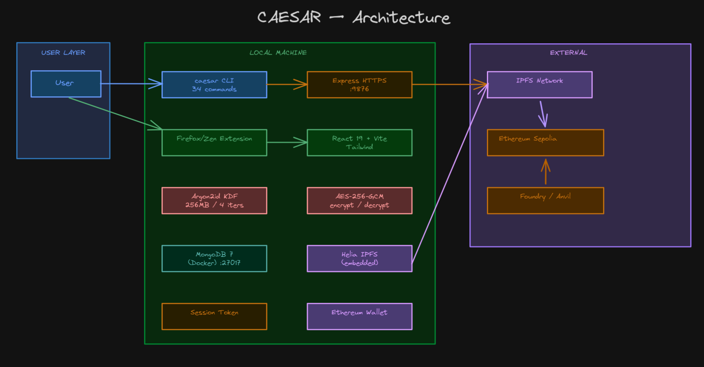

<h1 align="center">
  <code>CAESAR</code>
</h1>

<p align="center">
  A self-sovereign password manager where your encrypted vault never touches a third-party server.
</p>

<p align="center">
  <a href="#requirements">Requirements</a> &bull;
  <a href="#install">Install</a> &bull;
  <a href="#uninstall">Uninstall</a> &bull;
  <a href="#quickstart">Quickstart</a> &bull;
  <a href="#cli-reference">CLI</a> &bull;
  <a href="#server-endpoints">API</a> &bull;
  <a href="#security-model">Security</a>
</p>

---

## Requirements

| Dependency | Version | Notes |
|------------|---------|-------|
| Node.js | 22+ | LTS required for native crypto |
| Docker | latest | MongoDB + Express run in containers |
| Firefox or Zen Browser | latest | Extension target (auto-detected) |

Optional: `mkcert` for auto-trusted TLS (recommended). Falls back to self-signed if absent.

## Install

```bash
git clone https://github.com/Copernicium282/Caesar.git && cd Caesar
./scripts/install.sh
```

The installer runs a 5-phase TUI with progress bar:

1. **Dependencies** -- checks Node.js and Docker, installs if missing (apt/brew)
2. **Caesar** -- builds TypeScript, installs globally via npm
3. **Vault** -- runs `caesar init` (master password, TLS cert, wallet), trusts CA in Firefox/NSS
4. **Server** -- starts Docker Compose (MongoDB + Express), waits for health
5. **Extension** -- builds React UI, packages `.xpi` via web-ext

### Uninstall

```bash
./scripts/uninstall.sh
```

Removes Docker containers/images/volumes, uninstalls the npm package, deletes `~/.caesar/`, and removes the Caesar Vault CA from all Firefox and Zen Browser NSS trust stores.

## Quickstart

```bash
caesar init                # Set master password, generate TLS cert, create wallet
caesar start               # Start server via Docker
caesar launch              # Open Firefox/Zen with extension auto-loaded
```

## Architecture



- **Extension** -- React 19 + Vite + Tailwind. Manages entries, autofill, TOTP, password generation. Builds to a `.xpi` artifact via `web-ext`.
- **Express** -- Local HTTPS server on `127.0.0.1:9876`. TLS via mkcert CA (auto-trusted in Firefox/NSS).
- **MongoDB 7** -- Encrypted vault storage with healthcheck. Runs in Docker.
- **Helia IPFS** -- Embedded node for multi-device sync. Encrypted vault blobs stored on IPFS.
- **Ethereum Sepolia** -- On-chain commitment of vault hash + IPFS CID for multi-device sync.

## TLS / Certificates

Caesar uses `mkcert` to generate a CA-signed certificate during `caesar init`. The installer automatically trusts the CA in:

- Shared NSS database (`~/.pki/nssdb`)
- All Firefox profile trust stores (`~/.mozilla/firefox/*/cert9.db`)
- All Zen Browser profile trust stores (`~/.zen/*/cert9.db`)

This means no manual browser exception is needed. If mkcert is unavailable, falls back to `selfsigned` (requires manual exception).

## CLI Reference (34 commands)

### Vault Management

| Command | Description |
|---------|-------------|
| `caesar init` | Initialize vault, generate TLS cert, create wallet |
| `caesar unlock` | Unlock vault and create a 15-minute session |
| `caesar lock` | Clear the current session |
| `caesar change-password` | Change master password (re-encrypts all entries) |

### Entries

| Command | Description |
|---------|-------------|
| `caesar add [--generate] [--uri]` | Add a new entry |
| `caesar get <name> [--show] [-f]` | Retrieve a password or field |
| `caesar list [--json]` | List all entries |
| `caesar update <name>` | Update entry fields |
| `caesar search <query>` | Search entries by name/username/url/notes |
| `caesar favorite <name>` | Toggle favorite status |
| `caesar history <name>` | Show password history |
| `caesar totp <name>` | Show current TOTP code |

### Trash

| Command | Description |
|---------|-------------|
| `caesar delete <name>` | Soft delete entry (moves to trash) |
| `caesar restore <name>` | Restore entry from trash |
| `caesar permanent-delete <name>` | Permanently delete entry |
| `caesar trash` | List entries in trash |
| `caesar purge-trash` | Delete entries in trash older than 30 days |

### Folders

| Command | Description |
|---------|-------------|
| `caesar folder list` | List all folders |
| `caesar folder create <name>` | Create a folder |
| `caesar folder delete <name>` | Delete a folder |

### Import / Export

| Command | Description |
|---------|-------------|
| `caesar export [-f json\|csv] [-o]` | Export vault |
| `caesar import [-f json\|csv] <file>` | Import vault (max 10k entries) |

### Blockchain & Sync

| Command | Description |
|---------|-------------|
| `caesar snapshot [--remote]` | Commit vault hash + IPFS blob to blockchain |
| `caesar verify [--remote]` | Verify vault integrity |
| `caesar sync` | Pull vault from IPFS and apply locally |

### Wallet

| Command | Description |
|---------|-------------|
| `caesar wallet generate` | Generate Ethereum wallet |
| `caesar wallet address` | Show wallet address |

### Backup & Utilities

| Command | Description |
|---------|-------------|
| `caesar backup-salt <path>` | Backup Argon2 salt |
| `caesar restore-salt <path>` | Restore Argon2 salt |
| `caesar serve` | Start HTTPS server directly (no Docker) |

### Docker

| Command | Description |
|---------|-------------|
| `caesar start` | Start server via Docker |
| `caesar stop` | Stop server |

### Extension

| Command | Description |
|---------|-------------|
| `caesar install-extension` | Build extension + package `.xpi` |
| `caesar launch [-b browser]` | Open Firefox/Zen with extension auto-loaded via web-ext |

## Server Endpoints (36)

All authenticated endpoints require `Authorization: Bearer <token>` and `X-Caesar-Client: cli` headers.

| Method | Endpoint | Description |
|--------|----------|-------------|
| POST | `/unlock` | Authenticate, create session (rate limited) |
| POST | `/lock` | Clear session |
| GET | `/entries` | List non-deleted entries |
| POST | `/entries` | Create entry |
| PUT | `/entries/:name` | Update entry |
| DELETE | `/entries/:name` | Soft delete entry |
| DELETE | `/entries/:name/permanent` | Hard delete entry |
| POST | `/entries/:name/restore` | Restore from trash |
| PUT | `/entries/:name/favorite` | Toggle favorite |
| GET | `/entries/:name/history` | Password history |
| GET | `/entries/:name/totp` | Get TOTP code |
| PUT | `/entries/:name/totp` | Save TOTP secret |
| DELETE | `/entries/:name/totp` | Remove TOTP |
| GET | `/entries/:name/password` | Decrypt password |
| GET | `/entries/match?url=<url>` | Match URL to entries |
| GET | `/entries/search?q=<query>` | Search entries |
| GET | `/folders` | List folders |
| POST | `/folders` | Create folder |
| PUT | `/folders/:id` | Rename folder |
| DELETE | `/folders/:id` | Delete folder |
| GET | `/trash` | List deleted entries |
| POST | `/trash/purge` | Purge old trash |
| GET | `/generate?length=N` | Generate password (modulo-bias-free) |
| GET | `/generate/passphrase` | Generate EFF wordlist passphrase |
| POST | `/generate/history` | Save generation history |
| GET | `/generate/history` | Get generation history |
| DELETE | `/generate/history` | Clear generation history |
| POST | `/change-password` | Change master password |
| GET | `/vault-health` | Check weak/reused passwords |
| GET | `/snapshot/status` | Get vault hash |
| POST | `/snapshot` | Compute vault hash |
| POST | `/verify` | Verify vault integrity |
| POST | `/sync` | Push encrypted vault to IPFS |
| POST | `/export` | Export vault (JSON/CSV) |
| POST | `/import` | Import vault |
| GET | `/export/cli` | CLI export endpoint |

## Security Model

### What Caesar protects against

- **Third-party server breaches** -- vault never leaves your machine unencrypted
- **Password reuse** -- built-in zxcvbn strength detection
- **Single point of failure** -- IPFS multi-device sync
- **CSRF from web pages** -- `X-Caesar-Client` header requirement
- **Empty vault brute force** -- verification blob validates password even with no entries
- **Favicon tracking** -- letter-avatar avoids loading external favicons (no Google Favicon leak)
- **XSS in content scripts** -- all dynamic HTML uses `esc()` (textContent-to-innerHTML escape)

### What Caesar does NOT protect against

- **Compromised device** -- if your machine is owned, the vault is too
- **Phishing** -- warns about known phishing sites but can't catch all
- **Brute force** -- rate limiting helps but Argon2id is the real defense

### Cryptographic details

| Layer | Algorithm | Parameters |
|-------|-----------|------------|
| Key derivation | Argon2id | 256 MB memory, 4 iterations, 1 parallelism, 32-byte output |
| Encryption | AES-256-GCM | 12-byte IV, 16-byte auth tag |
| Password generation | `crypto.randomBytes` | Modulo-bias-free rejection sampling |
| Passphrase generation | EFF wordlist | `crypto.randomInt` index selection |
| Session tokens | `crypto.randomBytes(32)` | 15-minute expiry |
| Salt | `crypto.randomBytes(32)` | Per-vault, re-generated on password change |

### CORS

Restricted to `moz-extension://*` origins and `https://127.0.0.1:9876`. All other origins are rejected.

### Password history

When an entry's password is changed, the old password is re-encrypted with the new derivation key and appended to `passwordHistory` (capped at 5 entries). This happens on both CLI `update` and the `/entries/:name` endpoint.

## License

[GPL-3.0](LICENSE) — same as Bitwarden
